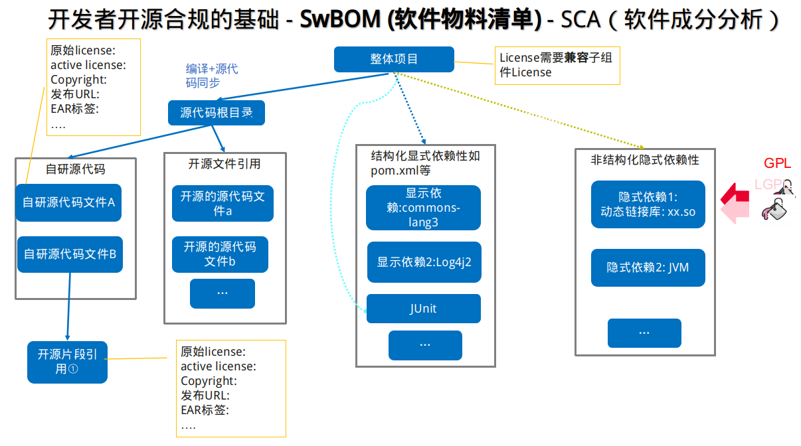
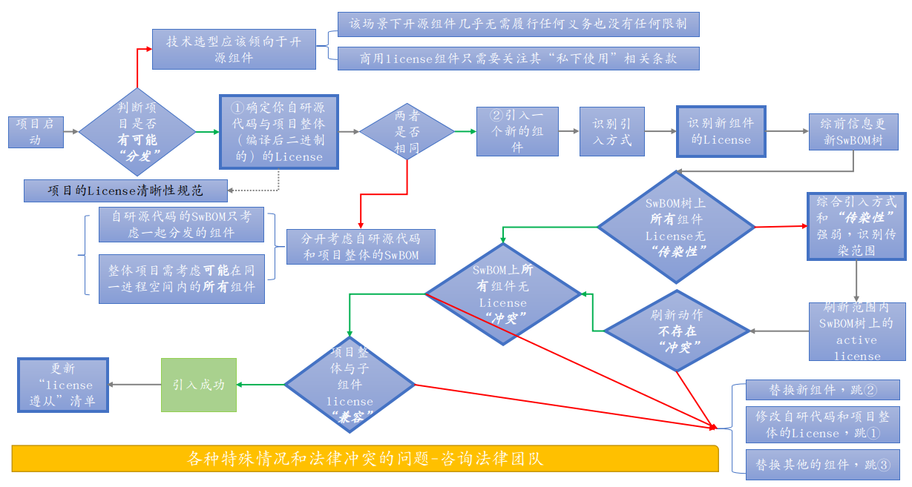

# 合规指导书  Version: V0.1beta

# 1 合规使用开源项目

## 1.1 技术选型

当我们在启动一个项目时，首先需要考虑的是项目是否有可能分发，若项目是在公司内部使用或其它不涉及分发的场景，那么这个项目整体而言非常幸运，技术选型可应该倾向于开源组件，大多数开源组件在不分发的场景下几乎无需履行任何义务也没有任何限制，使用商用license组件只需关注其“私下使用”相关条款即可。


## 1.2 建立SBOM树

合规实践的基础是SBOM（Software Bill of Material，软件物料清单），为了便于项目的管理以及基于项目的SBOM树构建SCA（Software Composition Analysis，软件成分分析），应建立项目的SBOM（Software Bill of Material，软件物料清单）树，通过建立SBOM可以建立起项目合规的最低要求以及提供项目的最佳实践。确定自研源代码与项目整体（编译后二进制的）的License，确保项目的License清晰性、规范性。



分析的核心主要包含三部分：license文本，源代码，依赖项

- license文本：将文本分析技术应用于源代码文件（有时还包括文档，目标代码， 数据文件等其他文件）中，以搜索对特定开源许可的引用或许可相关信息的其 他迹象的引用。
- 源代码：将源代码片段（有时是目标代码）与已知的被观测到的许可下的开 放源代码组成部分的辅助数据库进行比较。
- 依赖项：确定在构建时或安装时导入了哪些依赖（包括版本号码），以及从 已声明的许可的包注册表和/或观测到的许可的辅助数据库中检索许可信息。

需要注意的是：自研源代码的SBOM树只考虑一起分发的组件，原因是大多数开源组件的义务履行对应的是软件分发的场景。整体项目需考虑可能在同一进程空间内的所有组件，传染性较强GPL类许可证可以通过进程隔离的方式规避传染性。

### 1.2.1 源代码根目录

项目的License合规分析可以从源代码根目录开始，代码可以分为自研源代码部分和开源文件引用部分等。

**自研源代码：**

自研源代码包含完全自己写的源码文件A，以及开源片段引用的代码文件B， 这部分的软件成分包含原始的license以及active license。active license是其它有效的license，即原license被copyleft类型license传染后激活的license，如MIT license和GPL license在同一进程中使用，MIT license部分的代码也被感染成GPL。

**开源文件引用：**

开源文件引用是指直接使用开源的源代码文件等，使用时应保留开源源文件的copyright以及license信息，若开源源文件未在文件头添加license和copyright信息，应补充这部分信息。并在项目的notice文件或license文件夹补充这部分内容。

### 1.2.2 显示依赖

在软件开发中，依赖是指你的程序调用的外部代码。添加依赖可避免这些重复劳动：设计、编写、测试、调试、维护。依赖管理器（dependency manager）（或叫包管理器 —— package manager）可自动下载、安装所需的依赖包。

几乎每一门编程语言都有自己的依赖管理器，如Maven(Java)、Gomod(Go)、PyPi(Python)等。这些结构化的显示依赖可通过包管理器直接查看。

通过包管理器管理收录相应的第三方组件的license信息和copyright信息。

### 1.2.3 隐式依赖

对于一些项目，还存在隐式依赖项，如c/c++项目动态链接某个库，java项目依赖jvm等。同样需要关注这些隐式依赖项的license和copyright信息。

License的传染，可以由染色这个过程来形象的理解。染色的范围的大小，由油漆的内容（license), 和树枝的类型共同决定。若动态链接库的许可证是GPL，由于GPL的强传染性，同一进程空间的其它组件也会被相应的感染license；若动态链接库的许可证是LGPL，同一进程空间的其它组件license不会被感染。


## 1.3 引入开源组件

### 1.3.1 引入方式

项目中引入一个开源组件时，涉及多重引入方式，如源码引入、二进制文件引入等。使用开源组件的方式同样涉及多种形式，如设计、编写、测试、调试、链接使用等等，链接使用又包含动态链接、静态链接等，不同的使用方式可能对应不同的License义务。



### 1.3.2 刷新SBOM树

引入一款组件时，应优先识别新组件的License，将组件的信息加入SBOM树，将组件的信息加入SBOM树，结合之前的SBOM树提供的所有组件License确定是否有无传染性license。

### 1.3.3 SBOM树license传染性检查

在更新的SBOM树中，综合引入方式和“传染性”强弱，识别传染范围。如MPL类许可证，仅当修改的部分需开源，若修改了这部分代码，需做好管理和开源准备；若是GPL类许可证，则需刷新SBOM树上的active license(active license是指某些组件license可能因引入组件的传染性或自身组件license的传染性，将某些原本属于宽松型的license感染成copyleft型license)。

### 1.3.4 SBOM树license冲突性检查

刷新SBOM树过程中，若SBOM所有组件License无“传染性”，下一步应该关注所有组件有无License“冲突”条款，即两个或多个许可证中的条款能否同时满足，若出现不能同时满足的条款，则引入开源组件失败。以下有几种方式可供选择：

- 组件重新选型，替换新组件，流程回到2.1节
- 修改自研代码和项目整体的license，跳到流程2.2节
- 替换其它的组件，跳到流程2.3节

同理，上一节传染性检查中，可能出现各种冲突场景：如copyleft许可证的冲突：GPL-3.-only与GPL-2.0-only，这个两个许可证无法同时满足；专利条款冲突：Apache 2.0与 GPL -2.0-only不兼容。这些场景需按照上述方式重新选择。

### 1.3.5 更新“License遵从”清单

引入开源组件成功后，需要更新项目的license遵从性清单，可参考2.4节内容履行license义务。

## 1.4 履行开源义务

开源协议合规需满足license协议要求的开源义务。对于GPL类许可，在开源软件合规项目中应当全面履行相关开源义务，提供项目的SBOM以及源码。否则极有可能自动触发著作权许可合同的解除或终止条件，随之面临巨大的软件著作权侵权法律风险。


# 2 合规贡献开源项目

## 2.1 明确贡献目的

为开源社区做贡献是相互学习、分享和交流的的有益方式。 贡献者为开源项目做贡献的原因有很多，例如[1]：

- 个人对软件的兴趣
- 深入了解软件的功能
- 改进或增强软件的功能
- 从开源社区学习技术
- 获得社区认可，从社区建立声誉

在做贡献之前，对开源项目的以下信息的调研是必不可少的：

[License](https://choosealicense.com/) - 如果一个项目没有开源许可证，那它就不是开源的。通常，许可证对版权以及专利的使用有着明确说明，有助于保护开源贡献者和用户。

README - README会介绍项目相关的信息，也是潜在的贡献者了解项目相关内容的第一入口。

贡献者指南 - 这些指南帮助人们做出贡献并展示需要什么类型的贡献者

社区行为准则 - 社区环境通常是开放、包容的，需要遵守社区的行为准则。

  

## 2.2 贡献协议签署

**贡献者协议签署的目的：**

1. 贡献给社区的作品或代码版权授予给项目所有者，便于项目的维护和管理。
2. 为社区提供作品或代码的使用保证和免责声明，避免潜在的法律风险。

**贡献者协议介绍：**

开源社区的贡献者协议一般分为两种 CLA（Contributor License Agreement）和 DCO（ Developer Certificate of Origin）：CLA 可以看做是对开源软件本身采用的开源协议的补充。一般分为公司级和个人级别的 CLA，所谓公司级即某公司代表签署 CLA 后即可代表该公司所有员工都签署了该 CLA，而个人级别 CLA 只代表个人认可该 CLA。DCO 由 Linux Foundation 制定，DCO 的优点是较为简单，只需要在提交的时候签署邮件地址即可。

**CLA 包含哪些内容？**

1. Grant of Copyright License：贡献者拥有代码的版权（copyright），同时授权组织和项目的所有使用者使用这个版权。
2. Grant of Patent License：贡献者的贡献如果申请了专利（patent）保护，那么贡献者持有专利，同时授权组织者和项目使用者使用这个专利。

**DCO包含哪些内容？**

[DCO](https://developercertificate.org/) 协议签署时，贡献者需要保证以下四点：

1. 该贡献全部或部分由我创建，我有权根据文件中指明的开源许可提交；要么

2. 该贡献是基于以前的工作，这些工作属于适当的开源许可，无论这些工作全部还是部分由我完成，我有权根据相同的开源许可证（除非我被允许根据不同的许可证提交）提交修改后的工作；要么

3. 该贡献由1、2、或 3 证明的其他人直接提供给我，而我没有对其进行修改。

4. 我理解并同意该项目和贡献是公开的，并且该贡献的记录（包括我随之提交的所有个人信息，包括我的签字）将无限期保留，并且可以与本项目或涉及的开源许可证保持一致或者重新分配。


## 2.3 开源项目分析

刚接触一个新的开源项目时，并不总是清晰整个项目的组成成分，需要一层层分析。对于项目本身而言，应确保项目的license清晰性、规范性。对于开发者而言，参考2.2节建立SBOM树是比较困难的，大多数开源项目提供了整个项目的license清单列表，引入第三方组件或者贡献代码时，需注意这些义务条件是否能同时满足。如：

- 传染性  -  宽松型许可证的项目中引入copyleft类许可证的组件可能会传染整个项目
- 冲突性  - 不同许可证的之间的条款可能存在冲突


## 2.4 License义务履行

### 2.4.1 项目的license清单

许可扫描和合规不仅仅是为了项目开发人员的自身利益。正如一个项目应该考虑其入站依赖的许可，它也应该意识到下游用户、再发布者和开发人员在这基础上所形成的自己的依赖——并且会问许多关于项目许可组合的相同的问题。

- **项目根目录或notice文件存放license**。在项目的根目录下建立licenses文件夹，将所有的第三方开源组件license文件拷贝一份到此目录下；或者在项目的LICENSE文件存放所有的具有包含组件信息声明许可的文本。

- **在源文件中添加license和copyright**。如果项目中唯一的许可信息是其最高级LICENSE.txt文件，当源代码文件在一个处于不同许可的不同项目中被重新使用时，那么很难确定何种许可是适用的。

- **使用SPDX短格式标识符**。为了更容易地表示许可证，我们使用 [SPDX](http://spdx.org/) 唯一许可标识符([SPDX-identifiers](http://spdx.org/licenses/))。 例如，在源文件中，完整的“GPL v2.0或更高版本”标题文本将被一行替换:

  ```
  SPDX-License-Identifier:   GPL-2.0-or-later
  ```


### 2.4.2 License条款解读及义务履行

对于一些宽松型许可证而言，如MIT许可证，按照3.4.1节描述的方式申明许可证和版权人信息即可。对于copyleft类型许可证，相对而言，履行的义务较多。[貂蝉网站](https://compliance.openeuler.org/)收录了大多数常见许可证，并且列明了license的权利、义务和限制条件标签信息。

| License名称  | 义务                                                         |
| ------------ | ------------------------------------------------------------ |
| Apache-2.0   | 原始的Copyright 和 License文件必须被保留、列明修改           |
| BSD-4-Clause | 原始的Copyright 和 License文件必须被保留、分发软件时需要明确指明作者 |
| GPL-2.0-only | 原始的Copyright 和 License文件必须被保留、列明修改、软件分发时：需包含原始软件、源代码可获取、以相同的许可授予分发材料 |


### 2.4.3 License & copyright的规范性、清晰性

开发者贡献代码时，若是新增的代码文件，应申明license和copyright，注意license应于项目的发布license保证一致。对于一些小的bug修复或者少量非关键代码，可以选择放弃copyright申明。对于Apache-2.0或GPL类许可证等，若是修改他人的代码，应在修改的位置列明修改的内容。


# 3 主导开源项目

## 3.1 选择开源license

当主动开源项目时，应首先为项目选择一款合适的license，为社区开发者和使用者提供许可申明

**为什么需要选择开源license**

当我们选择将自己主导的项目源代码开放时，往往希望吸引更多的人参与开发和使用。若没有License，项目相关的内容是默认会被版权保护。开发者或社区使用你的源码会承担相应的风险。需要选择一个合适的 License ，赋予他人使用，分享和修改这个软件的权力。

**如何选择开源license**

可参考网站 [https://choosealicense.com/](https://link.zhihu.com/?target=https%3A//choosealicense.com/) 选择合适的license。在选择license之前，需关注两点：

（1）项目完全自研

若项目代码完全自研，选择license几乎没有任何限制，可根据自己的开源目的进行选择合适的license。

（2）项目部分自研

若项目基于开源组件构建，选择license需考虑第三方开源组件的义务履行、是否会有许可条款冲突、是否需与第三方组件许可证保持一致等。

## 3.2 设计CLA协议

**为什么要设计CLA协议：**

社区开发者在向社区贡献代码时，这部分代码的版权通常属于贡献者。而这部分代码可能涉及到一些专利，若开发者向其它使用这部分代码的组织或个人发起法律诉讼，会给开源项目和使用者带来很大的麻烦。

**CLA协议包含哪些内容**

1. Grant of Copyright License：贡献者拥有代码的版权（copyright），同时授权组织和项目的所有使用者使用这个版权。
2. Grant of Patent License：贡献者的贡献如果申请了专利（patent）保护，那么贡献者持有专利，同时授权组织者和项目使用者使用这个专利。

协议的核心在于“原创性确认”，也就是让提交者确认提交内容是自己创作或者经过别人授权的，并且充分了解项目方会如何使用自己的代码。

**如何设计CLA协议**

//TODO

## 3.3 项目合规自检

### 3.3.1 合规检查checklist

合规检查的项目包括但不限于：

- license & copyright 申明情况
- license义务履行
- 代码片段使用情况
- 开源组件使用情况
- 二进制集成情况
- 许可证条款是否有冲突
- 专利

### 3.3.2 义务履行

当项目涉及到一些开源组件时，关键义务之一是保留第三方开源组件的许可证和版权申明义务。

- 列出项目所使用开源软件（组件和片段），并保留开源软件许可申明和版权
- 遵守所使用开源软件的义务，如某些许可证要求列明修改

### 3.3.3 项目扫描

在扫描阶段，使用扫描工具对所有源码文件、文本文件进行扫描。例如可以使用“华佗”工具扫描源码的代码片段使用情况，使用“张飞”扫描项目中的许可和版权申明情况等。自研源代码或者使用第三方组件可能存在合规风险。在准备法律审查时，将源代码扫描的结果附在合规检查checklist上，例如任何复制、自述文件或许可文件，以及任何说明版权和归属通知的文件。

### 3.3.4 风险整改

在完成源码合规扫描后，针对扫描的结果进行确认。如是否出现license兼容性、是否存在片段引用、是否存在未履行第三方开源软件的义务等。按照扫描报告进行整改，整改完成后，再次进行源码扫描，确认风险清零。对任何有疑虑的结果进行标注，咨询相关律师或开源专家，按其意见进行整改。

### 3.3.5 审核与核可

一旦审计完成并且之前确定的所有问题都已解决，特定软件组件或片段的合规票证将在流程中进入审查阶段。 审阅者需要了解管理相关源代码的使用、修改和分发的许可证，并确定各种许可证的义务。

完成审核后，项目将进入批准步骤，由项目的开源管理者进行核实，并批准项目开源。

## 3.4 源码/版本发布

### 3.4.1 版本预发布

在正式对外开源之前，需要确定分发的方式，代码托管平台等。 分发前验证的目标是确保：

- 为履行许可义务而分发的开源代码已被识别和批准

- 源代码包已经经过合规检查和确认
- 项目中包含了许可信息，以及第三方开源软件的义务履行

### 3.4.2 版本发布

已检查所有分发前验证，未发现任何问题。 将项目相应的源码发布到网上。

### 3.4.3  最终验证

将开源包上传到分发网站后，请验证这些包是否已正确上传，并且可以在外部计算机上下载和解压缩而没有错误。企业最终验证阶段的开源合规性前提条件：源代码已发布在网站上。您会收到验证源代码已正确上传并可下载，并且它对应于已批准的相同版本。


## 3.5 门禁部署

对于主导型的开源项目，需要部署开发运维工具管理整个项目。外部开发者贡献开源社区时，需要使用开发运维工具自动管理整个项目。开源合规的检查应集成到门禁系统中。


**参考链接：**

[1] [Li Jia Qi](https://chinese.freecodecamp.org/news/author/li-jia-qi/). 如何为开源项目做贡献——入门指南. [DB/OL]. https://chinese.freecodecamp.org/news/how-to-contribute-to-open-source-projects-beginners-guide/


 