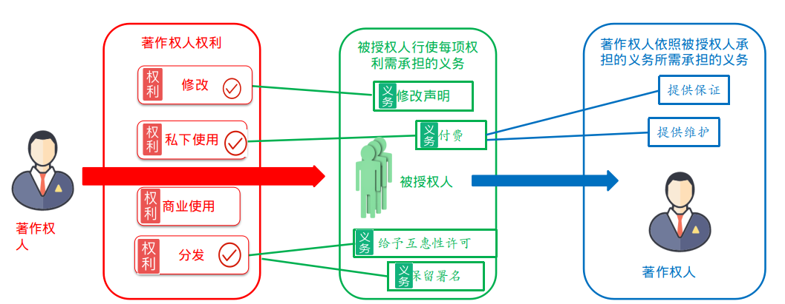
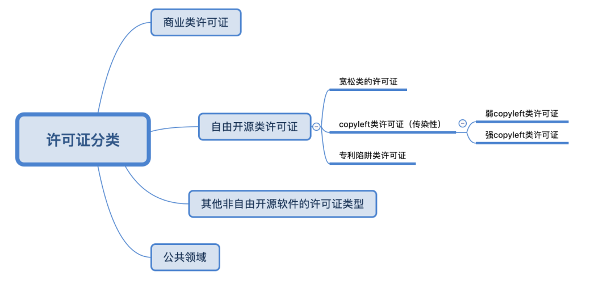

# 1. 基本概念

## 1.1 IPR

IPR：Intellectual property rights，即常被提到的知识产权。

知识产权是人类智慧创造的成果：如发明，文学和艺术作品，外观设计，商业中使用的符号、名称和形象等，主要涉及[著作权](https://zh.wikipedia.org/wiki/著作權)、[专利](https://zh.wikipedia.org/wiki/专利)、[商标](https://zh.wikipedia.org/wiki/商标)等领域。知识产权在法律上受专利、版权和商标等的保护，这让人们能够从其发明或创造中获得承认或经济利益[1]。

本文将聚焦在版权及专利上，该领域和开源软件合规最为相关。


### 1.1.1 Copyright

Copyright即版权，也叫著作权，属于IPR的一种。版权是作者依法对某一著作物享受的一系列“独占性”的权利，它的特点是：

- 不用申请天然享有
- 保护表达(不包含其背后的思想)
- 涵盖软件、书籍，音乐，电影等及其他相类作品

·

### 1.1.2 专利

专利是对发明授予的一种专有权利；具新颖性及不属于显著已知状态的实用发明。要取得专利，必须向公众公开发明的技术信息。

- 保护一种技术，功能性，或具体的思想。

- 需要申请


## 1.2 License

### 1.2.1 License的组成

License（许可证）是著作权的拥有者，授与权利给其他人的方法。可以理解成是一种“合同”。该“合同”有哪些特点：不需要双方签字，当使用者使用这个license许可的软件时合同生效。

License的条款由权利、义务、限制三种组成：

- 权利：你可以使用该软件做什么事情
- 义务：你使用这个软件时必须履行什么样的义务
- 限制：你不能够做什么事情



设计一个许可证的三步曲：

1. 挑选哪些著作权人权利授权给被授权人。

2. 在授予的每项权利上附加0-n项需被授权人承担的义务。每项权利上附加的义务可以不同。

3. 被授权人履行了某些义务的情况下，可以要求著作权人履行相关的某些义务。对应“貂蝉”：权利，义务，限制。

举例： A公司开发了某软件，授于B公司私下使用和修改的权利，B公司履行因为使用的权利向A公司支付100万RMB,  因为修改的权利，向A公司支付50万人民币。因为B公司付费了要求A公司，对软件提供质量保证，并提供维护工作。

所有的许可证都是：上述红框，绿框，蓝框的一个组合。

授予的权利，需要履行的义务的可以进一步按场景细分：比如分发场景、地理范围、时间期限等。

什么是开源许可证：一类组合。对于大部分开源许可证。权利（红框）均授予，著作权人几乎不承担任何义务（蓝框），只是被授权人承担的义务又较多不同（绿框）。


### 1.2.2 License的分类

常见的License类型除了本文重点关注的自由开源类许可证外，还包括商业类许可证，其它非自由开源软件的许可证，公共领域等。




### 1.2.3 License的选择

现有的开源许可证，数量成百上千，如何为代码选择开源许可证，可以参考乌克兰程序员Paul Bagwell画的分析图，阮一峰对该图做了翻译。


另外可参考博客[简述常见的几种开源协议](http://blog.itpub.net/ueditor/php/upload/image/20210717/1626486170836012.png)


### 1.2.4 License的规范使用

[软件包数据交换](https://spdx.org/) （SPDX）是Linux Foundation项目，旨在通过定义报告信息的标准来帮助减少软件的歧义。 许可证就是这样的一条信息。 SPDX提供了一种格式，用于列出适用于软件包的特定许可证变体和版本。 拥有300多个许可证，您很可能会找到自己使用的许可证。 许可证列表包含一个易于理解的名称，一个短名称以及指向完整许可证文本的链接。 SPDX还提供了将许可证文件的文本与许可证的正式文本进行匹配的[准则](https://spdx.org/spdx-license-list/matching-guidelines) [2]。

为了更容易地表示许可证，我们使用 [SPDX](http://spdx.org/) 唯一许可标识符([SPDX-identifiers](http://spdx.org/licenses/))。

例如，在源文件中，完整的“GPL v2.0或更高版本”标题文本将被一行替换:

```
SPDX-License-Identifier:     GPL-2.0-or-later
```

### 1.2.5 文档类常用的License

**“知识共享”协议是什么？**

“知识共享”是 Creative Commons 在中国大陆地区的通用译名，一般简称为 CC。CC 既是该国际组织的名称缩写，也是一种版权授权协议的统称。在目前网络上流行的授权许可证主要有

宽松型许可证--BSD 许可证及其系列、Apache-2.0、木兰许可证等

- GNU 系列

- CopyLeft 系列（事实上这个概念包括GNU系列

- CC 系列

其中，BSD 和 GNU 许可证更广泛应用于软件及其源码方面，而CC系列协议主要用于文字或艺术类的创作内容上。

**CC 协议如何构成？**

以下涉及 CC 协议内容的文本，是根据 CC 4.0 协议文本翻译的非官方版本。

CC 协议分为三个部分：可被程序识别的特征源码、可为一般人所理解的简易文本、正规的法律文本。其中，借由可被程序识别的特征源码，使得搜索引擎能够快速判断该内容是否为开放版权的内容，从而向使用者提供更精准的结果，这一设计也是 CC 协议的初衷。但是一般而言，在网络上普遍采用的可视结果是连接到 CC 官方网站的图片标识与简易声明。考虑到法律文本过于复杂与冗长，本文的介绍以简易文本为主。

CC 协议分为6个版本，每个版本在允许以及限制行为上都稍有区别。每份协议的简易文本都包括权利、义务和限制条件三部分。

CC 协议授予的权利：

- **分享 – 在任何媒介或格式下再分发、传播本创作。**
- 修改 – 重混、转换、依据本创作进行再创作。
- **只要遵守条款规定，授权人将不能撤回你使用本创作的自由。**

CC 协议的行为限制：

- 署名（BY） – 你必须以给予姓名标注，并提供本许可证的链接。同时你需要声明公开的创作是否经过修改。你可以采用恰当的形式将相关信息表述出来，但不得以任何形式暗示授权人已正式认可了你以及你的使用行为。
- 非商业性（NC） – 你不得将本创作运用于商业目的。
- 禁止演绎（ND） – 如果你对本创作进行了重混、转换、依据本创作进行再创作等行为，你不得再次公开散布经过修改的创作。意即，你只能全文转载或部分摘抄本创作中的内容，而不允许作出任何改动。
- 相同方式共享（SA） – 如果你对本创作进行了重混、转换、依据本创作进行再创作，你必须依据本创作采用的许可证来分发你的创作。
- 不得增加额外限制 – 你不能增设任何法律限制或是技术限制，来限制他人进行本许可证已经允许的行为。

### 1.2.6 特殊软件包的License

- 芯片软件

- 免费软件

- 二进制固件

- 其他等

## 1.3 自由软件与开源软件

### 1.3.1 自由软件基金会（FSF，Free Software of Foundation）

自由软件许可：自由软件基金会(FSF，Free software foundation)定义了什么是自由软件许可，FSF于1985年10月由Richard stallman建立。其主要工作是执行GNU计划，开发更多的自由软件。并给出了一个满足自由软件的license列表，也重点描述了GNU license和Copyleft. https://www.fsf.org/

FSF的主张是“自由软件”，并不是“免费”也不是“开源”，但它的实际结果造就了免费开源。自由软件的核心主张是“促进计算用户的自由”，简单地理解为用户可以自由执行、拷贝、发布、学习、修改和改进软件，因此自由软件是必须提供源码的。

FSF 概述了四项基本自由：

1、出于任何目的，按您的意愿运行程序的自由（自由 0）。

2、研究程序如何工作的自由，并对其进行更改，使其按照您的意愿进行计算（自由 1）。

3、重新分发副本的自由，以便您可以帮助他人（自由 2）。

4、将修改后的版本的副本分发给他人的自由（自由 3）。


### 1.3.2 开放源代码促进交流会（OSI， Open Source Initiative）

开放源代码促进会 (OSI，Open Source Initiative) 于1998年2月成立，创始人为Bruce Perens和Eric S. Raymond。开源软件许可：OSI 定义了什么是开源license (OSD),并核准的一个满足OSD的列表。官网链接为：https://www.opensource.org/

OSI主张是“开源”，目标：促进和保护开源软件及开源社区，致力于提高人们对开源软件的认识和采用。开源宗旨：更高的质量，更稳定的性能，更好的灵活性，更低的成本，并终结掠夺性供应商的封锁[3]。

OSI定义了十条准则：

1、自由再发布；

2、以源代码的形式再发布；

3、派生作品，要必须允许别人修改和衍生该作品，并且必须允许它们以相同的许可证分发；

4、作者源代码的完整性，自己修改的程序用不同的版本号与原始的做区分，软件用户有权知道作者是谁；

5、个人或团体不受歧视；

6、开源软件程序可以被使用在任何领域；

7、许可重新分发不得添加新的条款；

8、许可证不得只用于特定产品；

9、许可证不得限制其他软件；

10、许可协议必须是技术中立的。


### 1.3.3 FSF与OSI联系与区别

基于的价值观却有着本质上的区别。

对于自由软件运动而言，自由软件是一个道德底线，是对用户自由的基本尊重。

开源软件则与此不同，开源哲学考虑的是怎么做把软件做得“更好”—仅仅从实用的角度。开源的哲学里，非自由软件之所以不好，是因为他们采用了一种劣等的开发方式。

“开源软件和自由软件或多或少是同一类软件，虽然并不是完全相同：开源所接受的一些许可证我们看来限制过多，还有一些我们认可的自由软件他们不认可。但不管怎样，差异是很小的：几乎所有的自由软件都是开源软件，几乎所有的开源软件都是自由软件。”  [4]

违反FSF定义而未获得认可的许可证

| **Full Name**                   | **Identifier** | **FSF Free/Libre?** | **OSI Approved?** |
| ------------------------------- | -------------- | ------------------- | ----------------- |
| Apple Public Source License 1.2 | APSL-1.2       | No                  | Yes               |


APSL-1.2：任何在组织中“部署”的修改版本都必须发布。 --违反FSF自由度3


当然，还存在一类并未违反FSF定义或者OSI定义而未获得认可的许可证

| **Full Name**                        | **Identifier** | **FSF Free/Libre?** | **OSI Approved?** |
| ------------------------------------ | -------------- | ------------------- | ----------------- |
| Creative Commons Zero v1.0 Universal | CC0-1.0        | Yes                 | No                |

CC0-1.0：CC0 没有被明确拒绝，但OSI许可审查委员会未能就应批准达成共识，知识共享最终撤回了申请。 与第 4(a) 条的影响有关："No trademark or patent rights held by Affirmer are waived, abandoned, surrendered, licensed or otherwise affected by this document."  开源许可明确否认任何专利权转让的情况极为罕见，委员会认为批准此类许可将开创一个危险的先例，甚至可能削弱专利侵权防御可供使用 CC0 下发布的软件的用户使用。


## 1.4 自由开源软件合规的关键概念

### 1.4.1 License义务履行

许可证合规不仅仅是为了项目开发人员的自身利益。正如一个项目应该考虑其入站依赖的许可，它也应该意识到下游用户、再发布者和开发人员在这基础上所形 成的自己的依赖——并且会问许多关于项目许可组合的相同的问题。

许可证的义务履行

常见的开源软件许可证的义务可以分为以下两大类：

1.允许性或自由性许可证（要求很少）

- 按你认为合适的方式使用该代码

- 不提供质量担保

- 原样保留作者的copyright和license信息

  例子包括：BSD类许可证、MIT和Apache-2许可证

  但Apache-2许可证还要求若修改源代码，需提供修改说明

2.Copyleft（要求较多）

- 来源和衍生品必须在相同的版权条款下。
- 原样保留作者的copyright和license信息
- 如果你分发二进制文件，则必须提供源代码

例子包括：GPL、Affero GPL（AGPL）、Lesser GPL（LGPL）、Mozilla Public License（MPL）、Eclipse Public License（EPL）和Common Development and Distribution License（CDDL）。

所有组织在评估许可证风险时，都应该问四个问题：

- 什么是"发行"（distribution），它与我的组织有什么关系？
- 开源代码许可证如何影响软件的专利权？
- 什么是"通知"（notice）要求，我们如何遵守？
- 我们是否有"衍生作品"，以及与之相关的：将GPL代码纳入我的专有代码是否会导致专有代码在GPL下被许可？


### 1.4.2 多重许可

项目中存在双license、多license、license例外条款、可选license等多种组合情况。

// TODO

### 1.4.3 自由开源软件合规争议：分发

分发就是指将版权作品从一个人转移到另一个人。这意味着，如果你是自己使用，不提供给他人，就没有分发。另外，这里的"人"也指"法人"，因此如果使用方是公司，且只在公司内部使用，也不需要遵守许可证。

分发的场景：

- 对外部组织散播软件与素材

- 应用程序被下载到使用者的机器或装置

- JavaScript、网络服务客户端，或其他程序代码被下载到使用者的机器

- 对于某些开源软件许可证来说，通过过网络存取访问可视为触发点。

某些许可证对触发点的定义，包含对在服务器上运行的软件提供存取 (例如：所有 Affero GPL 版本皆作如此定义)，或是「使用者通过计算机网络远端与其互动」这种情境


### 1.4.4 自由开源软件合规争议：修改

依某些自由开源许可证，修改也许会在发行时带来义务性要求，例如：

- 提供修改声明

- 提供对应的程序源代码

- 依自由开源软件组件的同份许可证来授权该修改


**参考链接：**

[1] 维基百科编者. 知识产权[G/OL]. 维基百科, 2022(20220105)[2022-01-05]. [https://zh.wikipedia.org/w/index.php?title=%E7%9F%A5%E8%AF%86%E4%BA%A7%E6%9D%83&oldid=69496330](https://zh.wikipedia.org/w/index.php?title=知识产权&oldid=69496330).

[2] Alex Shi. Linux内核许可规则. [DB/OL]. https://www.kernel.org/doc/html/latest/translations/zh_CN/process/license-rules.html

[3]  The Open Source Definition. [DB/OL]. https://opensource.org/osd.*Version 1.9, last modified, 2007-03-22*

[4] Categories of Free and Nonfree Software. [DB/OL]  https://www.gnu.org/philosophy/categories.html.en