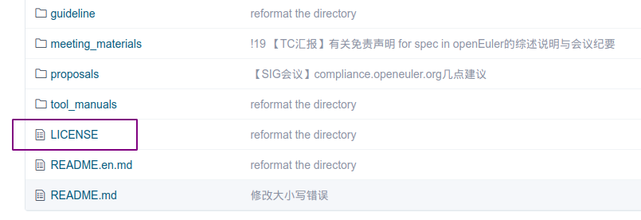
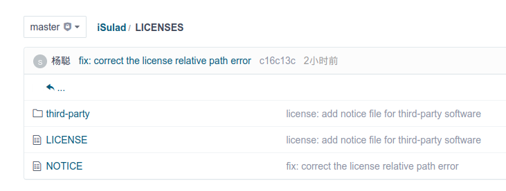
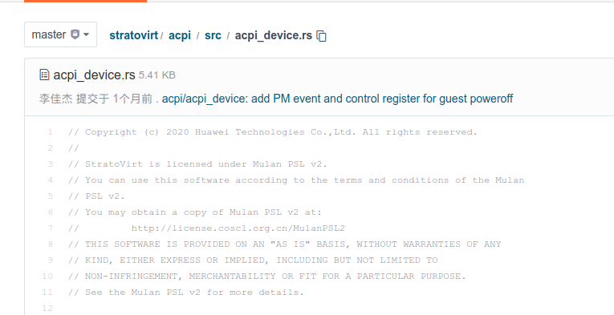
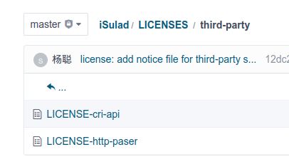
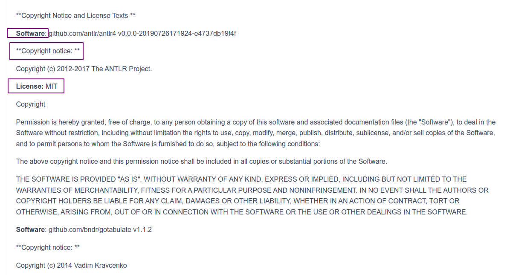
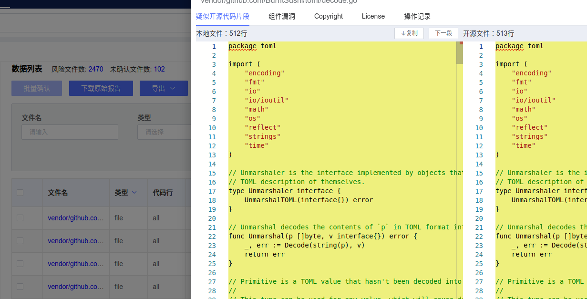
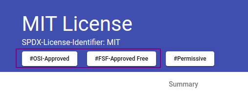

# openEuler社区代码仓合规风险问题整改指导教程

说明：社区代码仓库合规风险问题按照严重程度主要分为以下几类：

* 仓库未声明本仓库的许可证
* 源码文件未声明其license & copyright信息
* Notice声明
* 代码片段引用
* 非OSI或FSF认可的license
* 许可证的条款冲突或者不兼容

## 一、仓库本身的开源许可证声明

在代码仓的一级目录

一级目录声明：




或者在代码仓创建LICENSES文件夹进行声明：



## 二、源文件 license & copyright声明

所有的源码文件都应有license 和 copyright声明



源文件头license & copyright 申明规范示例1：

```plain
// Copyright (c) 2020 Huawei Technologies Co.,Ltd. All rights reserved.
//
// StratoVirt is licensed under Mulan PSL v2.
// You can use this software according to the terms and conditions of the Mulan
// PSL v2.
// You may obtain a copy of Mulan PSL v2 at:
//         http://license.coscl.org.cn/MulanPSL2
// THIS SOFTWARE IS PROVIDED ON AN "AS IS" BASIS, WITHOUT WARRANTIES OF ANY
// KIND, EITHER EXPRESS OR IMPLIED, INCLUDING BUT NOT LIMITED TO
// NON-INFRINGEMENT, MERCHANTABILITY OR FIT FOR A PARTICULAR PURPOSE.
// See the Mulan PSL v2 for more details.
```

源文件头license & copyright 申明规范示例2：

采用SPDX格式的license & copyright申明

```plain
模板
// SPDX-FileCopyrightText: [year] [copyright holder] <[email address]>
//
// SPDX-License-Identifier: [identifier]


样例1：
// SPDX-FileCopyrightText: 2015, 2017-2021 Madanm Joe <Madanm@example.com>
//
// SPDX-License-Identifier: GPL-2.0-or-later 

样例2：
// SPDX-FileCopyrightText: 2020 Huawei Technologies Co.,Ltd. All rights reserved.
//
// SPDX-License-Identifier: MulanPSL-2.0
```

某些license带有附录如何申明许可，如Apache-2.0许可证

```
APPENDIX: How to apply the Apache License to your work.

To apply the Apache License to your work, attach the following boilerplate notice, with the fields enclosed by brackets "[]" replaced with your own identifying information. (Don't include the brackets!) The text should be enclosed in the appropriate comment syntax for the file format. We also recommend that a file or class name and description of purpose be included on the same "printed page" as the copyright notice for easier identification within third-party archives.

Copyright [yyyy] [name of copyright owner]

Licensed under the Apache License, Version 2.0 (the "License");
you may not use this file except in compliance with the License.
You may obtain a copy of the License at

http://www.apache.org/licenses/LICENSE-2.0

Unless required by applicable law or agreed to in writing, software
distributed under the License is distributed on an "AS IS" BASIS,
WITHOUT WARRANTIES OR CONDITIONS OF ANY KIND, either express or implied.
See the License for the specific language governing permissions and
limitations under the License.
```


对于BSD类许可证，如BSD-2-Clause许可证，从许可证原文难以识别该许可证的名称。

因此为了清晰性，较为推荐的写法是在许可证原文后附上该许可证的SPDX格式的名称

```
Copyright (c) <year> <owner>. All rights reserved.

Redistribution and use in source and binary forms, with or without modification, are permitted provided that the following conditions are met:

1.Redistributions of source code must retain the above copyright notice, this list of conditions and the following disclaimer.
2.Redistributions in binary form must reproduce the above copyright notice, this list of conditions and the following disclaimer in the documentation and/or other materials provided with the distribution.
THIS SOFTWARE IS PROVIDED BYTHE COPYRIGHT HOLDERS AND CONTRIBUTORS "AS IS" AND ANYEXPRESS OR IMPLIED WARRANTIES, INCLUDING, BUT NOT LIMITED TO, THE IMPLIED WARRANTIES OF MERCHANTABILITYAND FITNESS FOR A PARTICULAR PURPOSE ARE DISCLAIMED. IN NO EVENT SHALLTHE COPYRIGHT HOLDER OR CONTRIBUTORS BE LIABLE FORANY DIRECT, INDIRECT, INCIDENTAL, SPECIAL, EXEMPLARY, OR CONSEQUENTIAL DAMAGES (INCLUDING, BUT NOTLIMITED TO, PROCUREMENT OF SUBSTITUTE GOODS OR SERVICES; LOSS OF USE, DATA, OR PROFITS; OR BUSINESSINTERRUPTION) HOWEVER CAUSED AND ON ANY THEORY OF LIABILITY, WHETHER IN CONTRACT, STRICT LIABILITY, ORTORT (INCLUDING NEGLIGENCE OR OTHERWISE) ARISING IN ANY WAY OUT OF THE USE OF THIS SOFTWARE, EVEN IFADVISED OF THE POSSIBILITY OF SUCH DAMAGE.

SPDX-License-Identifier: BSD-2-Clause
```

在 SPDX 许可证列表中找到许可证的 SPDX 标识符。 并将许可证文本信息拷贝并放在 LICENSES/ 目录中。

许可证SPDX标识符查找网站：

[https://compliance.openeuler.org/](https://compliance.openeuler.org/)

[https://spdx.org/licenses/](https://spdx.org/licenses/)

## 三 Notice申明

项目中引用的所有第三方软件都需履行其许可义务，其中，最为常见的义务是保留第三方软件的许可证和版权信息申明。

推荐方式一：

项目的根目录下建立LICENSES文件夹，并创建一个third-party目录，将项目用到的所有的第三方软件许可证原文（含版权）拷贝到third-party目录下，每个文件以第三方软件名命名



推荐方式二：

在项目的根目录下创建一个License目录，并创建名为Third_Party_Open_Source_Software_Notice的文件

将项目涉及到的所有第三方软件许可证原文（含版权）拷贝到该文件中



推荐方式三：

在项目的根目录下创建Notice文件，将项目涉及到的所有第三方软件许可证原文（含版权）拷贝到该文件中，与方式二形式上相似。


## 四 代码片段引用

代码片段引用是指项目复制他人代码或者基于第三方代码进行修改，未获得第三方授权或者基于开源代码而未履行对应义务，如Apache-2.0 许可证有要求修改了他人代码，需在代码修改处添加修改说明

华佗工具提供了社区代码片段引用情况的能力，不过工具存在误报，需要手工确认这部分代码是否为下面几种情况：

- 确认为自研 ，则无需整改

- 使用第三方代码
  - 第三方代码为开源代码：  履行相应的开源许可证的义务
  - 第三方代码为非开源代码：立刻整改，将此提交代码移除

注意：若github或网站上获取的代码未申明许可证，此代码非开源代码，除非获取作者书面授权，若使用存在较大风险

openEuler仓库代码片段引用确认网站：

[https://sca.osinfra.cn/](https://sca.osinfra.cn/)

确认步骤：
1 登录授权sca平台：
选择openEuler社区对应的仓库，会显示有风险的文件和已确认的文件数


2 点击左侧文件名进行查看比较，会显示疑似开源代码片段来源，相识代码行数等


3 从未确认的文件列表中进行确认


## 五 非OSI或FSF认可的license

通常，对于非自由开源软件许可证是不建议引入的，自由开源软件许可证是经过FSF或OSI认证的许可证。

自由开源软件概念介绍：[https://gitee.com/openeuler/compliance/blob/master/guideline/concept.md#13-%E8%87%AA%E7%94%B1%E8%BD%AF%E4%BB%B6%E4%B8%8E%E5%BC%80%E6%BA%90%E8%BD%AF%E4%BB%B6](https://gitee.com/openeuler/compliance/blob/master/guideline/concept.md#13-%E8%87%AA%E7%94%B1%E8%BD%AF%E4%BB%B6%E4%B8%8E%E5%BC%80%E6%BA%90%E8%BD%AF%E4%BB%B6)

是否为自由开源软件查询：[https://compliance.openeuler.org/](https://compliance.openeuler.org/)




## 六 许可证兼容性

**许可证兼容性**是指许可证条件之间存在冲突、无法同时满足，因此无法将多个许可证对应的软件打包到同一个项目之中。

常见的开源许可证兼容性可通过貂蝉网站兼容性分析表在线查询。

兼容性查询表： https://compliance.openeuler.org/compatiableTable

例如： 查询使用GPL-2.0-only许可证的项目是否可以引入以MIT许可的组件

