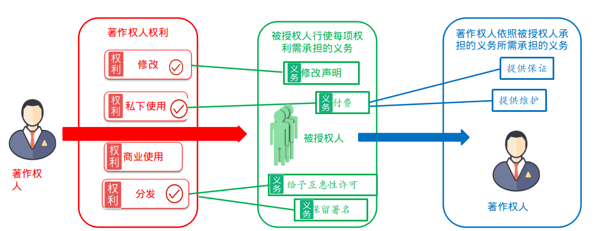
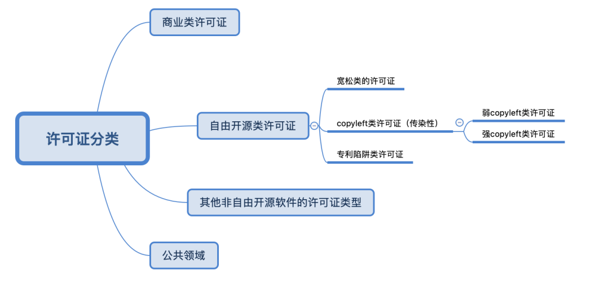

# 合规指导书  Version: V0.1beta

# 1. 基本概念

## 1.1 IPR

IPR：Intellectual property rights，即常被提到的知识产权。

知识产权是人类智慧创造的成果：如发明，文学和艺术作品，外观设计，商业中使用的符号、名称和形象等，主要涉及[著作权](https://zh.wikipedia.org/wiki/著作權)、[专利](https://zh.wikipedia.org/wiki/专利)、[商标](https://zh.wikipedia.org/wiki/商标)等领域。知识产权在法律上受专利、版权和商标等的保护，这让人们能够从其发明或创造中获得承认或经济利益[1]。

本文将聚焦在版权及专利上，该领域和开源软件合规最为相关。


### 1.1.1 Copyright

Copyright即版权，也叫著作权，属于IPR的一种。版权是作者依法对某一著作物享受的一系列“独占性”的权利，它的特点是：

- 不用申请天然享有
- 保护表达(不包含其背后的思想)
- 涵盖软件、书籍，音乐，电影等及其他相类作品

·

### 1.1.2 专利

专利是对发明授予的一种专有权利；具新颖性及不属于显著已知状态的实用发明。要取得专利，必须向公众公开发明的技术信息。

- 保护一种技术，功能性，或具体的思想。

- 需要申请


## 1.2 License

### 1.2.1 License的组成

License（许可证）是著作权的拥有者，授与权利给其他人的方法。可以理解成是一种“合同”。该“合同”有哪些特点：不需要双方签字，当使用者使用这个license许可的软件时合同生效。

License的条款由权利、义务、限制三种组成：

- 权利：你可以使用该软件做什么事情
- 义务：你使用这个软件时必须履行什么样的义务
- 限制：你不能够做什么事情



设计一个许可证的三步曲：

1. 挑选哪些著作权人权利授权给被授权人。

2. 在授予的每项权利上附加0-n项需被授权人承担的义务。每项权利上附加的义务可以不同。

3. 被授权人履行了某些义务的情况下，可以要求著作权人履行相关的某些义务。对应“貂蝉”：权利，义务，限制。

举例： A公司开发了某软件，授于B公司私下使用和修改的权利，B公司履行因为使用的权利向A公司支付100万RMB,  因为修改的权利，向A公司支付50万人民币。因为B公司付费了要求A公司，对软件提供质量保证，并提供维护工作。

所有的许可证都是：上述红框，绿框，蓝框的一个组合。

授予的权利，需要履行的义务的可以进一步按场景细分：比如分发场景、地理范围、时间期限等。

什么是开源许可证：一类组合。对于大部分开源许可证。权利（红框）均授予，著作权人几乎不承担任何义务（蓝框），只是被授权人承担的义务又较多不同（绿框）。


### 1.2.2 License的分类

常见的License类型除了本文重点关注的自由开源类许可证外，还包括商业类许可证，其它非自由开源软件的许可证，公共领域等。




### 1.2.3 License的选择

现有的开源许可证，数量成百上千，如何为代码选择开源许可证，可以参考乌克兰程序员Paul Bagwell画的分析图，阮一峰对该图做了翻译。


另外可参考博客[简述常见的几种开源协议](http://blog.itpub.net/ueditor/php/upload/image/20210717/1626486170836012.png)


### 1.2.4 License的规范使用

[软件包数据交换](https://spdx.org/) （SPDX）是Linux Foundation项目，旨在通过定义报告信息的标准来帮助减少软件的歧义。 许可证就是这样的一条信息。 SPDX提供了一种格式，用于列出适用于软件包的特定许可证变体和版本。 拥有300多个许可证，您很可能会找到自己使用的许可证。 许可证列表包含一个易于理解的名称，一个短名称以及指向完整许可证文本的链接。 SPDX还提供了将许可证文件的文本与许可证的正式文本进行匹配的[准则](https://spdx.org/spdx-license-list/matching-guidelines) [2]。

为了更容易地表示许可证，我们使用 [SPDX](http://spdx.org/) 唯一许可标识符([SPDX-identifiers](http://spdx.org/licenses/))。

例如，在源文件中，完整的“GPL v2.0或更高版本”标题文本将被一行替换:

```
SPDX-License-Identifier:     GPL-2.0-or-later
```

### 1.2.5 文档类常用的License

**“知识共享”协议是什么？**

“知识共享”是 Creative Commons 在中国大陆地区的通用译名，一般简称为 CC。CC 既是该国际组织的名称缩写，也是一种版权授权协议的统称。在目前网络上流行的授权许可证主要有

宽松型许可证--BSD 许可证及其系列、Apache-2.0、木兰许可证等

- GNU 系列

- CopyLeft 系列（事实上这个概念包括GNU系列

- CC 系列

其中，BSD 和 GNU 许可证更广泛应用于软件及其源码方面，而CC系列协议主要用于文字或艺术类的创作内容上。

**CC 协议如何构成？**

以下涉及 CC 协议内容的文本，是根据 CC 4.0 协议文本翻译的非官方版本。

CC 协议分为三个部分：可被程序识别的特征源码、可为一般人所理解的简易文本、正规的法律文本。其中，借由可被程序识别的特征源码，使得搜索引擎能够快速判断该内容是否为开放版权的内容，从而向使用者提供更精准的结果，这一设计也是 CC 协议的初衷。但是一般而言，在网络上普遍采用的可视结果是连接到 CC 官方网站的图片标识与简易声明。考虑到法律文本过于复杂与冗长，本文的介绍以简易文本为主。

CC 协议分为6个版本，每个版本在允许以及限制行为上都稍有区别。每份协议的简易文本都包括权利、义务和限制条件三部分。

CC 协议授予的权利：

- **分享 – 在任何媒介或格式下再分发、传播本创作。**
- 修改 – 重混、转换、依据本创作进行再创作。
- **只要遵守条款规定，授权人将不能撤回你使用本创作的自由。**

CC 协议的行为限制：

- 署名（BY） – 你必须以给予姓名标注，并提供本许可证的链接。同时你需要声明公开的创作是否经过修改。你可以采用恰当的形式将相关信息表述出来，但不得以任何形式暗示授权人已正式认可了你以及你的使用行为。
- 非商业性（NC） – 你不得将本创作运用于商业目的。
- 禁止演绎（ND） – 如果你对本创作进行了重混、转换、依据本创作进行再创作等行为，你不得再次公开散布经过修改的创作。意即，你只能全文转载或部分摘抄本创作中的内容，而不允许作出任何改动。
- 相同方式共享（SA） – 如果你对本创作进行了重混、转换、依据本创作进行再创作，你必须依据本创作采用的许可证来分发你的创作。
- 不得增加额外限制 – 你不能增设任何法律限制或是技术限制，来限制他人进行本许可证已经允许的行为。

### 1.2.6 特殊软件包的License

- 芯片软件

- 免费软件

- 二进制固件

- 其他等

## 1.3 自由软件与开源软件

### 1.3.1 自由软件基金会（FSF，Free Software of Foundation）

自由软件许可：自由软件基金会(FSF，Free software foundation)定义了什么是自由软件许可，FSF于1985年10月由Richard stallman建立。其主要工作是执行GNU计划，开发更多的自由软件。并给出了一个满足自由软件的license列表，也重点描述了GNU license和Copyleft. https://www.fsf.org/

FSF的主张是“自由软件”，并不是“免费”也不是“开源”，但它的实际结果造就了免费开源。自由软件的核心主张是“促进计算用户的自由”，简单地理解为用户可以自由执行、拷贝、发布、学习、修改和改进软件，因此自由软件是必须提供源码的。

FSF 概述了四项基本自由：

1、出于任何目的，按您的意愿运行程序的自由（自由 0）。

2、研究程序如何工作的自由，并对其进行更改，使其按照您的意愿进行计算（自由 1）。

3、重新分发副本的自由，以便您可以帮助他人（自由 2）。

4、将修改后的版本的副本分发给他人的自由（自由 3）。


### 1.3.2 开放源代码促进交流会（OSI， Open Source Initiative）

开放源代码促进会 (OSI，Open Source Initiative) 于1998年2月成立，创始人为Bruce Perens和Eric S. Raymond。开源软件许可：OSI 定义了什么是开源license (OSD),并核准的一个满足OSD的列表。官网链接为：https://www.opensource.org/

OSI主张是“开源”，目标：促进和保护开源软件及开源社区，致力于提高人们对开源软件的认识和采用。开源宗旨：更高的质量，更稳定的性能，更好的灵活性，更低的成本，并终结掠夺性供应商的封锁[3]。

OSI定义了十条准则：

1、自由再发布；

2、以源代码的形式再发布；

3、派生作品，要必须允许别人修改和衍生该作品，并且必须允许它们以相同的许可证分发；

4、作者源代码的完整性，自己修改的程序用不同的版本号与原始的做区分，软件用户有权知道作者是谁；

5、个人或团体不受歧视；

6、开源软件程序可以被使用在任何领域；

7、许可重新分发不得添加新的条款；

8、许可证不得只用于特定产品；

9、许可证不得限制其他软件；

10、许可协议必须是技术中立的。


### 1.3.3 FSF与OSI联系与区别

基于的价值观却有着本质上的区别。

对于自由软件运动而言，自由软件是一个道德底线，是对用户自由的基本尊重。

开源软件则与此不同，开源哲学考虑的是怎么做把软件做得“更好”—仅仅从实用的角度。开源的哲学里，非自由软件之所以不好，是因为他们采用了一种劣等的开发方式。

“开源软件和自由软件或多或少是同一类软件，虽然并不是完全相同：开源所接受的一些许可证我们看来限制过多，还有一些我们认可的自由软件他们不认可。但不管怎样，差异是很小的：几乎所有的自由软件都是开源软件，几乎所有的开源软件都是自由软件。”  [4]

违反FSF定义而未获得认可的许可证

| **Full Name**                   | **Identifier** | **FSF Free/Libre?** | **OSI Approved?** |
| ------------------------------- | -------------- | ------------------- | ----------------- |
| Apple Public Source License 1.2 | APSL-1.2       | No                  | Yes               |


APSL-1.2：任何在组织中“部署”的修改版本都必须发布。 --违反FSF自由度3


当然，还存在一类并未违反FSF定义或者OSI定义而未获得认可的许可证

| **Full Name**                        | **Identifier** | **FSF Free/Libre?** | **OSI Approved?** |
| ------------------------------------ | -------------- | ------------------- | ----------------- |
| Creative Commons Zero v1.0 Universal | CC0-1.0        | Yes                 | No                |

CC0-1.0：CC0 没有被明确拒绝，但OSI许可审查委员会未能就应批准达成共识，知识共享最终撤回了申请。 与第 4(a) 条的影响有关："No trademark or patent rights held by Affirmer are waived, abandoned, surrendered, licensed or otherwise affected by this document."  开源许可明确否认任何专利权转让的情况极为罕见，委员会认为批准此类许可将开创一个危险的先例，甚至可能削弱专利侵权防御可供使用 CC0 下发布的软件的用户使用。


## 1.4 自由开源软件合规的关键概念

### 1.4.1 License义务履行

许可证合规不仅仅是为了项目开发人员的自身利益。正如一个项目应该考虑其入站依赖的许可，它也应该意识到下游用户、再发布者和开发人员在这基础上所形 成的自己的依赖——并且会问许多关于项目许可组合的相同的问题。

许可证的义务履行

常见的开源软件许可证的义务可以分为以下两大类：

1.允许性或自由性许可证（要求很少）

- 按你认为合适的方式使用该代码

- 不提供质量担保

- 原样保留作者的copyright和license信息

  例子包括：BSD类许可证、MIT和Apache-2许可证

  但Apache-2许可证还要求若修改源代码，需提供修改说明

2.Copyleft（要求较多）

- 来源和衍生品必须在相同的版权条款下。
- 原样保留作者的copyright和license信息
- 如果你分发二进制文件，则必须提供源代码

例子包括：GPL、Affero GPL（AGPL）、Lesser GPL（LGPL）、Mozilla Public License（MPL）、Eclipse Public License（EPL）和Common Development and Distribution License（CDDL）。

所有组织在评估许可证风险时，都应该问四个问题：

- 什么是"发行"（distribution），它与我的组织有什么关系？
- 开源代码许可证如何影响软件的专利权？
- 什么是"通知"（notice）要求，我们如何遵守？
- 我们是否有"衍生作品"，以及与之相关的：将GPL代码纳入我的专有代码是否会导致专有代码在GPL下被许可？


### 1.4.2 多重许可

项目中存在双license、多license、license例外条款、可选license等多种组合情况。

// TODO

### 1.4.3 自由开源软件合规争议：分发

分发就是指将版权作品从一个人转移到另一个人。这意味着，如果你是自己使用，不提供给他人，就没有分发。另外，这里的"人"也指"法人"，因此如果使用方是公司，且只在公司内部使用，也不需要遵守许可证。

分发的场景：

- 对外部组织散播软件与素材

- 应用程序被下载到使用者的机器或装置

- JavaScript、网络服务客户端，或其他程序代码被下载到使用者的机器

- 对于某些开源软件许可证来说，通过过网络存取访问可视为触发点。

某些许可证对触发点的定义，包含对在服务器上运行的软件提供存取 (例如：所有 Affero GPL 版本皆作如此定义)，或是「使用者通过计算机网络远端与其互动」这种情境


### 1.4.4 自由开源软件合规争议：修改

依某些自由开源许可证，修改也许会在发行时带来义务性要求，例如：

- 提供修改声明

- 提供对应的程序源代码

- 依自由开源软件组件的同份许可证来授权该修改


# 2 合规使用开源项目


## 2.1 技术选型

当我们在启动一个项目时，首先需要考虑的是项目是否有可能分发，若项目是在公司内部使用或其它不涉及分发的场景，那么这个项目整体而言非常幸运，技术选型可应该倾向于开源组件，大多数开源组件在不分发的场景下几乎无需履行任何义务也没有任何限制，使用商用license组件只需关注其“私下使用”相关条款即可。


## 2.2 建立SBOM树

合规实践的基础是SBOM（Software Bill of Material，软件物料清单），为了便于项目的管理以及基于项目的SBOM树构建SCA（Software Composition Analysis，软件成分分析），应建立项目的SBOM（Software Bill of Material，软件物料清单）树，通过建立SBOM可以建立起项目合规的最低要求以及提供项目的最佳实践。确定自研源代码与项目整体（编译后二进制的）的License，确保项目的License清晰性、规范性。


分析的核心主要包含三部分：license文本，源代码，依赖项

- license文本：将文本分析技术应用于源代码文件（有时还包括文档，目标代码， 数据文件等其他文件）中，以搜索对特定开源许可的引用或许可相关信息的其 他迹象的引用。
- 源代码：将源代码片段（有时是目标代码）与已知的被观测到的许可下的开 放源代码组成部分的辅助数据库进行比较。
- 依赖项：确定在构建时或安装时导入了哪些依赖（包括版本号码），以及从 已声明的许可的包注册表和/或观测到的许可的辅助数据库中检索许可信息。

需要注意的是：自研源代码的SBOM树只考虑一起分发的组件，原因是大多数开源组件的义务履行对应的是软件分发的场景。整体项目需考虑可能在同一进程空间内的所有组件，传染性较强GPL类许可证可以通过进程隔离的方式规避传染性。

### 2.2.1 源代码根目录

项目的License合规分析可以从源代码根目录开始，代码可以分为自研源代码部分和开源文件引用部分等。

**自研源代码：**

自研源代码包含完全自己写的源码文件A，以及开源片段引用的代码文件B， 这部分的软件成分包含原始的license以及active license。active license是其它有效的license，即原license被copyleft类型license传染后激活的license，如MIT license和GPL license在同一进程中使用，MIT license部分的代码也被感染成GPL。

**开源文件引用：**

开源文件引用是指直接使用开源的源代码文件等，使用时应保留开源源文件的copyright以及license信息，若开源源文件未在文件头添加license和copyright信息，应补充这部分信息。并在项目的notice文件或license文件夹补充这部分内容。

### 2.2.2 显示依赖

在软件开发中，依赖是指你的程序调用的外部代码。添加依赖可避免这些重复劳动：设计、编写、测试、调试、维护。依赖管理器（dependency manager）（或叫包管理器 —— package manager）可自动下载、安装所需的依赖包。

几乎每一门编程语言都有自己的依赖管理器，如Maven(Java)、Gomod(Go)、PyPi(Python)等。这些结构化的显示依赖可通过包管理器直接查看。

通过包管理器管理收录相应的第三方组件的license信息和copyright信息。

### 2.2.3 隐式依赖

对于一些项目，还存在隐式依赖项，如c/c++项目动态链接某个库，java项目依赖jvm等。同样需要关注这些隐式依赖项的license和copyright信息。

License的传染，可以由染色这个过程来形象的理解。染色的范围的大小，由油漆的内容（license), 和树枝的类型共同决定。若动态链接库的许可证是GPL，由于GPL的强传染性，同一进程空间的其它组件也会被相应的感染license；若动态链接库的许可证是LGPL，同一进程空间的其它组件license不会被感染。


## 2.3 引入开源组件

### 2.3.1 引入方式

项目中引入一个开源组件时，涉及多重引入方式，如源码引入、二进制文件引入等。使用开源组件的方式同样涉及多种形式，如设计、编写、测试、调试、链接使用等等，链接使用又包含动态链接、静态链接等，不同的使用方式可能对应不同的License义务。


### 2.3.2 刷新SBOM树

引入一款组件时，应优先识别新组件的License，将组件的信息加入SBOM树，将组件的信息加入SBOM树，结合之前的SBOM树提供的所有组件License确定是否有无传染性license。

### 2.3.3 SBOM树license传染性检查

在更新的SBOM树中，综合引入方式和“传染性”强弱，识别传染范围。如MPL类许可证，仅当修改的部分需开源，若修改了这部分代码，需做好管理和开源准备；若是GPL类许可证，则需刷新SBOM树上的active license(active license是指某些组件license可能因引入组件的传染性或自身组件license的传染性，将某些原本属于宽松型的license感染成copyleft型license)。

### 2.3.4 SBOM树license冲突性检查

刷新SBOM树过程中，若SBOM所有组件License无“传染性”，下一步应该关注所有组件有无License“冲突”条款，即两个或多个许可证中的条款能否同时满足，若出现不能同时满足的条款，则引入开源组件失败。以下有几种方式可供选择：

- 组件重新选型，替换新组件，流程回到2.1节
- 修改自研代码和项目整体的license，跳到流程2.2节
- 替换其它的组件，跳到流程2.3节

同理，上一节传染性检查中，可能出现各种冲突场景：如copyleft许可证的冲突：GPL-3.-only与GPL-2.0-only，这个两个许可证无法同时满足；专利条款冲突：Apache 2.0与 GPL -2.0-only不兼容。这些场景需按照上述方式重新选择。

### 2.3.5 更新“License遵从”清单

引入开源组件成功后，需要更新项目的license遵从性清单，可参考2.4节内容履行license义务。

## 2.4 履行开源义务

开源协议合规需满足license协议要求的开源义务。对于GPL类许可，在开源软件合规项目中应当全面履行相关开源义务，提供项目的SBOM以及源码。否则极有可能自动触发著作权许可合同的解除或终止条件，随之面临巨大的软件著作权侵权法律风险。


# 3 合规贡献开源项目

## 3.1 明确贡献目的

为开源社区做贡献是相互学习、分享和交流的的有益方式。 贡献者为开源项目做贡献的原因有很多，例如[5]：

- 个人对软件的兴趣
- 深入了解软件的功能
- 改进或增强软件的功能
- 从开源社区学习技术
- 获得社区认可，从社区建立声誉

在做贡献之前，对开源项目的以下信息的调研是必不可少的：

[License](https://choosealicense.com/) - 如果一个项目没有开源许可证，那它就不是开源的。通常，许可证对版权以及专利的使用有着明确说明，有助于保护开源贡献者和用户。

README - README会介绍项目相关的信息，也是潜在的贡献者了解项目相关内容的第一入口。

贡献者指南 - 这些指南帮助人们做出贡献并展示需要什么类型的贡献者

社区行为准则 - 社区环境通常是开放、包容的，需要遵守社区的行为准则。

##  

## 3.2 贡献协议签署

**贡献者协议签署的目的：**

1. 贡献给社区的作品或代码版权授予给项目所有者，便于项目的维护和管理。
2. 为社区提供作品或代码的使用保证和免责声明，避免潜在的法律风险。

**贡献者协议介绍：**

开源社区的贡献者协议一般分为两种 CLA（Contributor License Agreement）和 DCO（ Developer Certificate of Origin）：CLA 可以看做是对开源软件本身采用的开源协议的补充。一般分为公司级和个人级别的 CLA，所谓公司级即某公司代表签署 CLA 后即可代表该公司所有员工都签署了该 CLA，而个人级别 CLA 只代表个人认可该 CLA。DCO 由 Linux Foundation 制定，DCO 的优点是较为简单，只需要在提交的时候签署邮件地址即可。

**CLA 包含哪些内容？**

1. Grant of Copyright License：贡献者拥有代码的版权（copyright），同时授权组织和项目的所有使用者使用这个版权。
2. Grant of Patent License：贡献者的贡献如果申请了专利（patent）保护，那么贡献者持有专利，同时授权组织者和项目使用者使用这个专利。

**DCO包含哪些内容？**

[DCO](https://developercertificate.org/) 协议签署时，贡献者需要保证以下四点：

1. 该贡献全部或部分由我创建，我有权根据文件中指明的开源许可提交；要么

2. 该贡献是基于以前的工作，这些工作属于适当的开源许可，无论这些工作全部还是部分由我完成，我有权根据相同的开源许可证（除非我被允许根据不同的许可证提交）提交修改后的工作；要么

3. 该贡献由1、2、或 3 证明的其他人直接提供给我，而我没有对其进行修改。

4. 我理解并同意该项目和贡献是公开的，并且该贡献的记录（包括我随之提交的所有个人信息，包括我的签字）将无限期保留，并且可以与本项目或涉及的开源许可证保持一致或者重新分配。


## 3.3 开源项目分析

刚接触一个新的开源项目时，并不总是清晰整个项目的组成成分，需要一层层分析。对于项目本身而言，应确保项目的license清晰性、规范性。对于开发者而言，参考2.2节建立SBOM树是比较困难的，大多数开源项目提供了整个项目的license清单列表，引入第三方组件或者贡献代码时，需注意这些义务条件是否能同时满足。如：

- 传染性  -  宽松型许可证的项目中引入copyleft类许可证的组件可能会传染整个项目
- 冲突性  - 不同许可证的之间的条款可能存在冲突


## 3.4 License义务履行

### 3.4.1 项目的license清单

许可扫描和合规不仅仅是为了项目开发人员的自身利益。正如一个项目应该考虑其入站依赖的许可，它也应该意识到下游用户、再发布者和开发人员在这基础上所形成的自己的依赖——并且会问许多关于项目许可组合的相同的问题。

- **项目根目录或notice文件存放license**。在项目的根目录下建立licenses文件夹，将所有的第三方开源组件license文件拷贝一份到此目录下；或者在项目的LICENSE文件存放所有的具有包含组件信息声明许可的文本。

- **在源文件中添加license和copyright**。如果项目中唯一的许可信息是其最高级LICENSE.txt文件，当源代码文件在一个处于不同许可的不同项目中被重新使用时，那么很难确定何种许可是适用的。

- **使用SPDX短格式标识符**。为了更容易地表示许可证，我们使用 [SPDX](http://spdx.org/) 唯一许可标识符([SPDX-identifiers](http://spdx.org/licenses/))。 例如，在源文件中，完整的“GPL v2.0或更高版本”标题文本将被一行替换:

  ```
  SPDX-License-Identifier:   GPL-2.0-or-later
  ```


### 3.4.2 License条款解读及义务履行

对于一些宽松型许可证而言，如MIT许可证，按照3.4.1节描述的方式申明许可证和版权人信息即可。对于copyleft类型许可证，相对而言，履行的义务较多。[貂蝉网站](https://compliance.openeuler.org/)收录了大多数常见许可证，并且列明了license的权利、义务和限制条件标签信息。

| License名称  | 义务                                                         |
| ------------ | ------------------------------------------------------------ |
| Apache-2.0   | 原始的Copyright 和 License文件必须被保留、列明修改           |
| BSD-4-Clause | 原始的Copyright 和 License文件必须被保留、分发软件时需要明确指明作者 |
| GPL-2.0-only | 原始的Copyright 和 License文件必须被保留、列明修改、软件分发时：需包含原始软件、源代码可获取、以相同的许可授予分发材料 |


### 3.4.3 License & copyright的规范性、清晰性

开发者贡献代码时，若是新增的代码文件，应申明license和copyright，注意license应于项目的发布license保证一致。对于一些小的bug修复或者少量非关键代码，可以选择放弃copyright申明。对于Apache-2.0或GPL类许可证等，若是修改他人的代码，应在修改的位置列明修改的内容。


# 4 其它合规内容


# 附录

## 自由开源软件历史

## 自由开源软件趣事

## 合规陷阱及案例分享

## FAQ


**参考链接：**

[1] 维基百科编者. 知识产权[G/OL]. 维基百科, 2022(20220105)[2022-01-05]. [https://zh.wikipedia.org/w/index.php?title=%E7%9F%A5%E8%AF%86%E4%BA%A7%E6%9D%83&oldid=69496330](https://zh.wikipedia.org/w/index.php?title=知识产权&oldid=69496330).

[2] Alex Shi. Linux内核许可规则. [DB/OL]. https://www.kernel.org/doc/html/latest/translations/zh_CN/process/license-rules.html

[3]  The Open Source Definition. [DB/OL]. https://opensource.org/osd.*Version 1.9, last modified, 2007-03-22*

[4] Categories of Free and Nonfree Software. [DB/OL]  https://www.gnu.org/philosophy/categories.html.en

[5] [Li Jia Qi](https://chinese.freecodecamp.org/news/author/li-jia-qi/). 如何为开源项目做贡献——入门指南. [DB/OL]. https://chinese.freecodecamp.org/news/how-to-contribute-to-open-source-projects-beginners-guide/


 